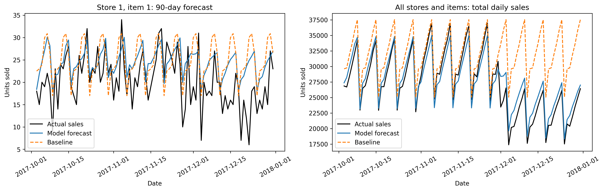

# Store Item Demand Forecasting & Inventory Optimization

End-to-end project that forecasts daily sales for each store and item, then turns the forecasts into recommended inventory levels for a target service level.

## Dataset
Store Item Demand Forecasting data (Kaggle): 913,000 rows, 10 stores × 50 items (500 series), daily sales from 2013-01-01 to 2017-12-31. Forecast horizon: 90 days (2018-01-01 to 2018-03-31).

## Approach
1. Features: calendar variables (year, month, day, weekday) and lagged sales (1, 7, 30 days)
2. Model: ExtraTreesRegressor
3. Forecasting: recursive day-by-day, so lags are always correct over the 90-day horizon
4. Validation: time-based. Train until 2017-10-02, forecast the last 90 days, compare with a baseline (average of the same weekday over the last 8 weeks)
5. Inventory policy: lead-time demand (7 days) + safety stock for a 95% service level, based on the measured error of the lead-time forecast
6. Costs: holding cost (0.5 per unit per day) and stockout cost (2.0 per unit), set as assumptions

## Results (validation, 90-day recursive forecast)

| Metric | Model | Baseline |
|---|---|---|
| RMSE | 9.38 | 15.59 |
| MAE | 7.28 | 11.66 |
| SMAPE | 15.59% | - |

The model reduces RMSE by **39.8%** compared with the baseline.

| Inventory policy | Service level | Avg. stockout cost | Avg. total cost |
|---|---|---|---|
| Forecast only | 63.9% | 27.43 | 37.24 |
| Forecast + safety stock | 97.0% | 0.93 | 35.80 |

Adding safety stock raises the service level from 63.9% to 97.0% and cuts stockout costs by about 97%, with a slight reduction in total cost.

   

## Limitations
- Holding cost, stockout cost, and lead time are assumptions, not real business data.
- The policy check uses the same validation period that was used to measure the forecast error, so the service level is an estimate, not an out-of-sample guarantee.

## Files
- `store_item_forecast_and_inventory_opt.py`: full pipeline
- `inventory_plan.csv`: forecasts and recommended inventory per store, item, and date

## Author
Ismail Chahboune
